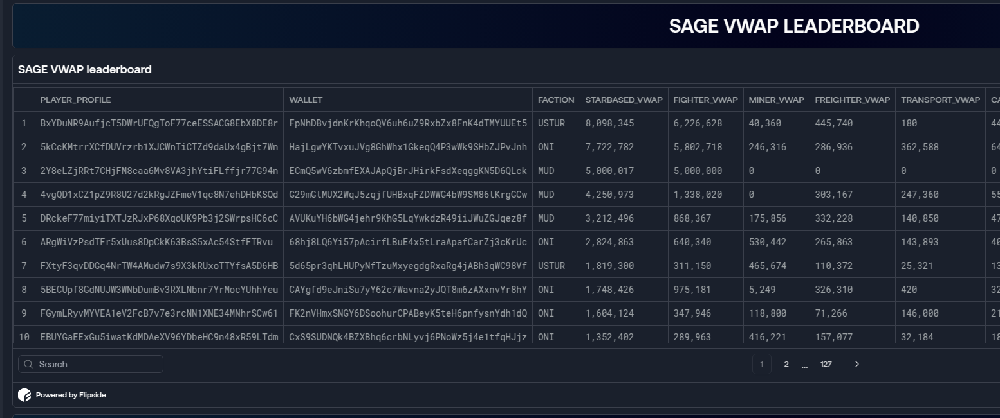
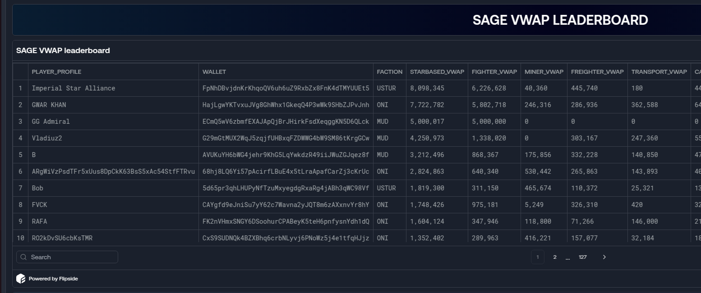

# Aephia Flipside Enhancer

**Aephia Flipside Enhancer** is a tool that makes your Aephia dashboards on Flipside easier to read. It replaces long, confusing public keys with friendly, descriptive names so you can quickly understand what you're looking at.

## What It Does

- **Easier-to-Read Dashboard:**  
  Instead of showing long, random strings (public keys) for player profiles and fleets, the tool displays clear, descriptive names.

- **Automatic Updates:**  
  The script automatically fetches the latest friendly names from an online lookup list. This means you always see the most up-to-date information—without any extra effort.

- **Works in the Background:**  
  Once installed, it runs quietly in your web browser when you visit an Aephia dashboard, so you don’t need to do anything extra.

## Before and After

**Without the Enhancer (shows public keys):**

**With the Enhancer (shows display names):**

## How to Install

### Step 1: Install Tampermonkey

Tampermonkey is a free browser extension that runs small programs (userscripts) like this one.

- **For Chrome:**  
  [Install Tampermonkey from the Chrome Web Store](https://chrome.google.com/webstore/detail/tampermonkey/dhdgffkkebhmkfjojejmpbldmpobfkfo)

- **For Firefox:**  
  [Install Tampermonkey from Mozilla Add-ons](https://addons.mozilla.org/en-US/firefox/addon/tampermonkey/)

### Step 2: Install the Aephia Flipside Enhancer Script

1. Click the following link to install the script directly:  
   [Install Aephia Flipside Enhancer](https://raw.githubusercontent.com/222TheMaster222/aephia-flipside-enhancer/main/aephia-flipside-enhancer.user.js)
2. When prompted by your browser, confirm to install the script in Tampermonkey.

### Step 3: Enjoy an Enhanced Dashboard

- **Automatic Operation:**  
  Once installed, open any Aephia dashboard on Flipside and the enhancer will automatically swap out the unreadable public keys for clear names.

- **Auto-Updates:**  
  The script is set up to receive updates automatically. When improvements are made, Tampermonkey will prompt you to update, ensuring you always have the latest version.

## Frequently Asked Questions

**Q: Do I need to do anything else?**  
A: No! After installation, the tool works in the background. Simply refresh or visit an Aephia dashboard to see the enhancements.

**Q: What if I still see a public key instead of a name?**  
A: Sometimes there might not be a matching friendly name in the lookup list yet. We’re continuously updating the list, so check back later for improvements.

**Q: How do I force an update?**  
A: You can manually update the script from the Tampermonkey dashboard if needed, or it will auto-update as new versions are released.

## Need Help?

If you experience any issues or have suggestions for improving the dashboard experience, please [open an issue](https://github.com/222TheMaster222/aephia-flipside-enhancer/issues) in our repository.

---

*This project is dedicated to making Aephia dashboards on Flipside more user-friendly. Enjoy your enhanced experience!*
